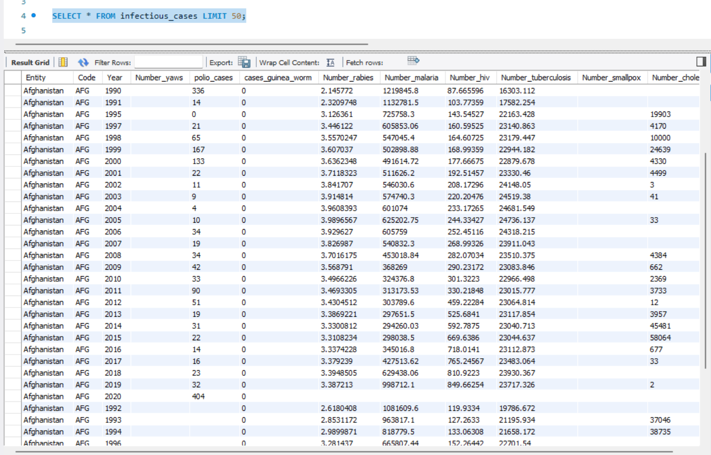
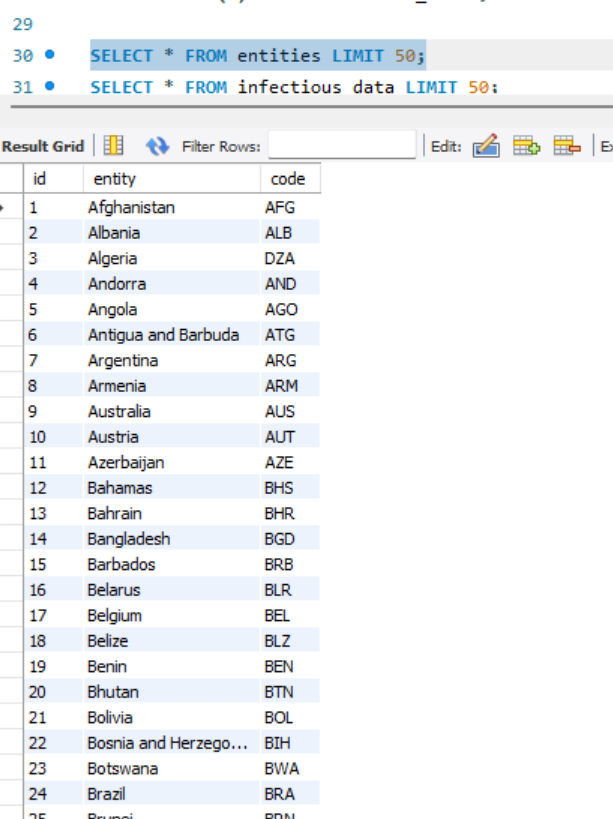
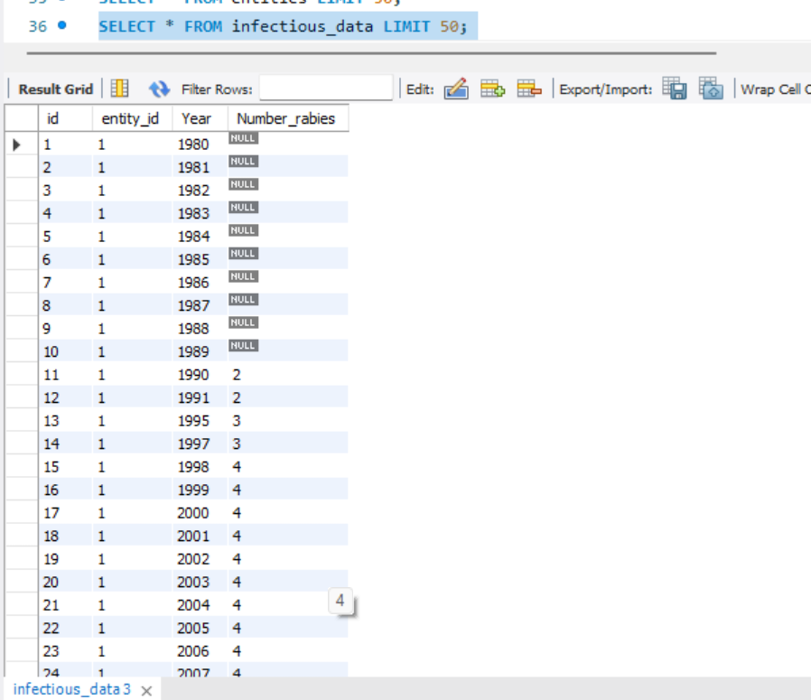
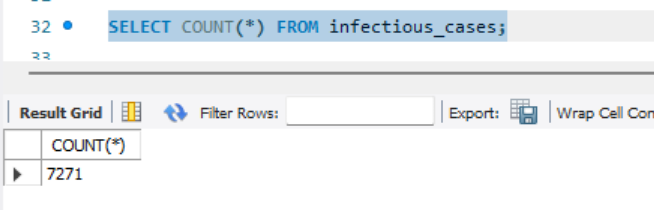
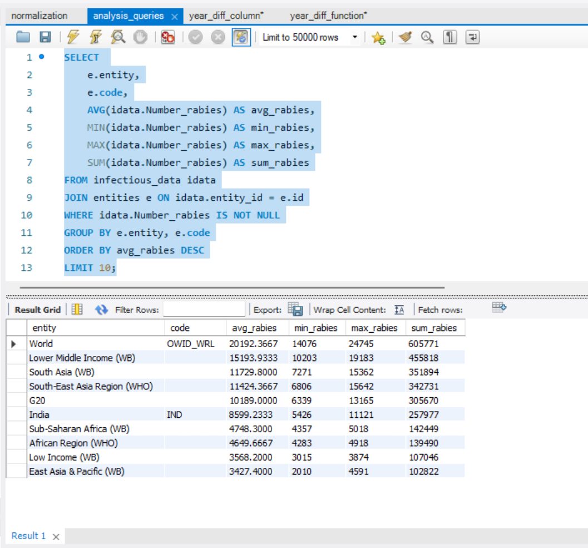
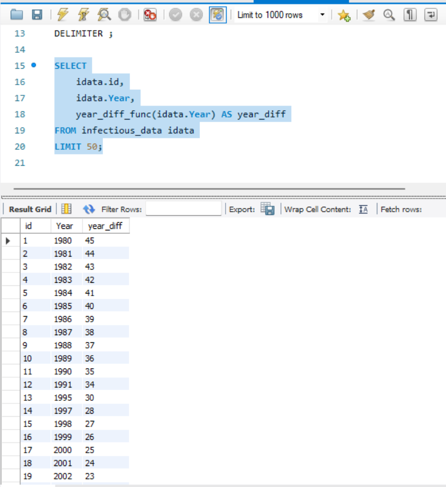

# Final Project

## ОПИС ВИКОНАНИХ КРОКІВ
### Завдання 1 — Імпорт даних

Створена схема:
CREATE SCHEMA IF NOT EXISTS pandemic;
USE pandemic;
Дані імпортовано через Import Wizard.
Перші записи таблиці:

Cкриншот:

### Завдання 2 — Нормалізація таблиці

Створено таблицю entities:

SQL у файлі normalization.sql

CREATE TABLE entities (
    id INT AUTO_INCREMENT PRIMARY KEY,
    entity VARCHAR(255),
    code VARCHAR(10)
);

INSERT INTO entities (entity, code)
SELECT DISTINCT Entity, Code
FROM infectious_cases;

Створено таблицю infectious_data:

CREATE TABLE infectious_data (
    id INT AUTO_INCREMENT PRIMARY KEY,
    entity_id INT,
    Year INT,
    Number_rabies INT,
    FOREIGN KEY (entity_id) REFERENCES entities(id)
);

INSERT INTO infectious_data (entity_id, Year, Number_rabies)
SELECT e.id, ic.Year, NULLIF(ic.Number_rabies, '')
FROM infectious_cases ic
JOIN entities e
     ON ic.Entity = e.entity
    AND ic.Code = e.code;

Підрахунок завантажених рядків:

SELECT COUNT(*) FROM infectious_cases;

### Завдання 3 — Аналітичні запити

У файлі: analysis_queries.sql
✔ Розрахунок середніх, мінімальних, максимальних і сумарних значень:
SELECT
    e.entity,
    e.code,
    AVG(idata.Number_rabies) AS avg_rabies,
    MIN(idata.Number_rabies) AS min_rabies,
    MAX(idata.Number_rabies) AS max_rabies,
    SUM(idata.Number_rabies) AS sum_rabies
FROM infectious_data idata
JOIN entities e ON idata.entity_id = e.id
WHERE idata.Number_rabies IS NOT NULL
GROUP BY e.entity, e.code
ORDER BY avg_rabies DESC
LIMIT 10;

Результат:

### Завдання 4 — Колонка різниці в роках (SQL-функції)

Файл: year_diff_column.sql
SQL:
SELECT
    idata.id,
    idata.Year,
    STR_TO_DATE(CONCAT(idata.Year, '-01-01'), '%Y-%m-%d') AS year_start_date,
    CURDATE() AS today,
    TIMESTAMPDIFF(
        YEAR,
        STR_TO_DATE(CONCAT(idata.Year, '-01-01'), '%Y-%m-%d'),
        CURDATE()
    ) AS year_diff
FROM infectious_data idata
LIMIT 50;

Результат:

### Завдання 5 — Власна SQL-функція

Файл: year_diff_function.sql
Створення функції:
DELIMITER //

CREATE FUNCTION year_diff_func(input_year INT)
RETURNS INT
DETERMINISTIC
BEGIN
    DECLARE year_start DATE;
    SET year_start = STR_TO_DATE(CONCAT(input_year, '-01-01'), '%Y-%m-%d');
    RETURN TIMESTAMPDIFF(YEAR, year_start, CURDATE());
END//

DELIMITER ;

Використання функції:
SELECT
    idata.id,
    idata.Year,
    year_diff_func(idata.Year) AS year_diff
FROM infectious_data idata
LIMIT 50;

Результат:

### Висновок

У цьому фінальному проєкті виконано:

✔ створення схеми та імпорт даних
✔ нормалізація таблиці до 3НФ
✔ аналітичні запити із сортуванням і групуванням
✔ побудова нової колонки за допомогою SQL-функцій
✔ створення власної SQL-функції