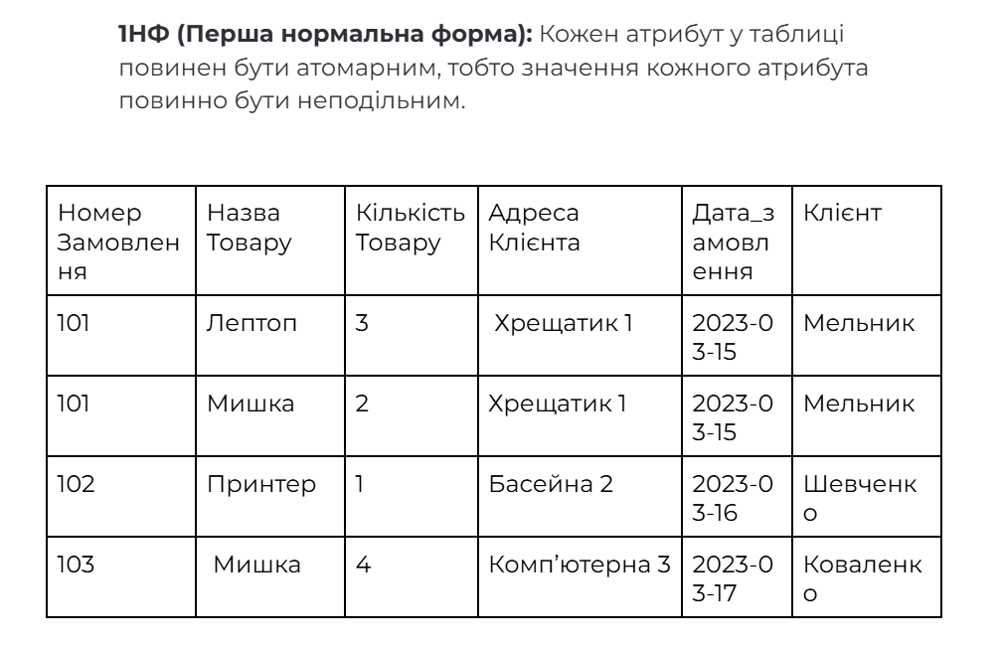
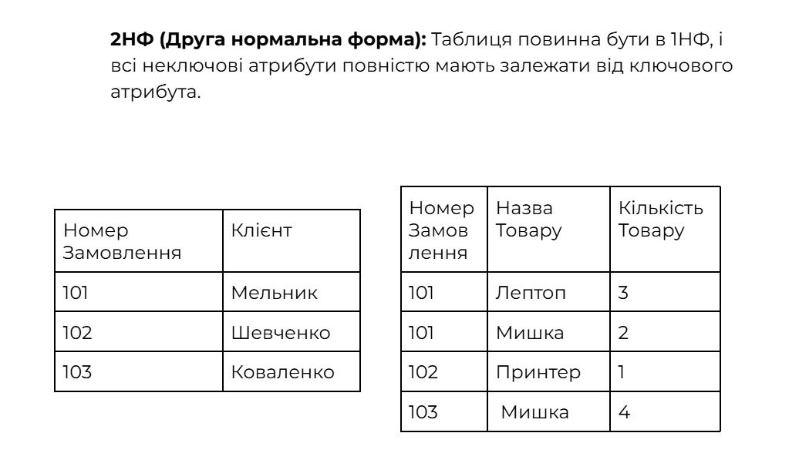
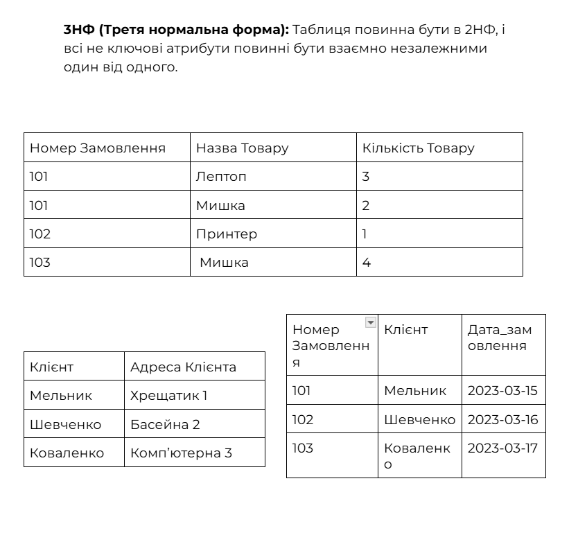
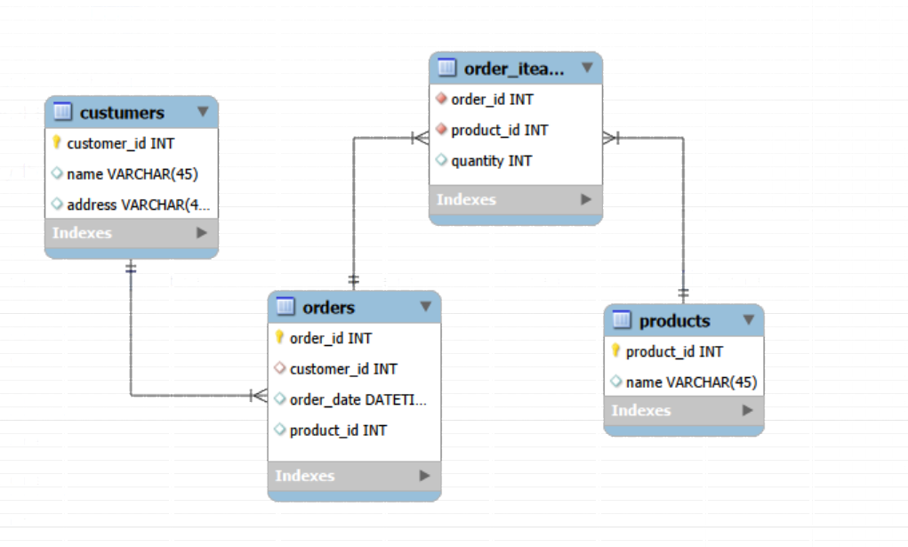
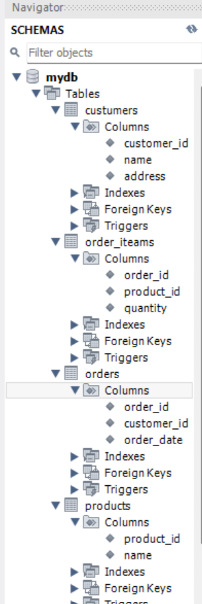

# Домашнє завдання №2

## Крок 1. Переведіть початкову таблицю в першу нормальну форму (1НФ)

- Виконайте розбиття даних так, щоб кожен атрибут був атомарним.
- Приберіть повторювані групи.

> Скріншот:
>
> 

---

## Крок 2. Переведіть нові таблиці в другу нормальну форму (2НФ)

- Вилучіть часткові залежності.
- Розділіть таблиці так, щоб усі неключові атрибути залежали від усього ключа.

> Скріншот:
>
> 

---

## Крок 3. Переведіть нові таблиці в третю нормальну форму (3НФ)

- Усуньте транзитивні залежності.
- Залиште лише атрибути, що залежать від первинного ключа.

> Скріншот:
>
> 

---

## Крок 4. Розробіть ER-діаграму отриманих таблиць

- Побудуйте діаграму з усіма сутностями та зв’язками.
- Вкажіть первинні та зовнішні ключі.
- Переконайтеся, що діаграма відповідає нормалізованим таблицям.
- Відобразіть зв’язки 1→N та N↔N.

> Скріншот:
>
> 

---

## Крок 5. Створено таблиці в базі даних

- Створіть таблиці та колонки з урахуванням зв’язків.
- Це можна зробити вручну або автоматично через Forward Engineer.

> Скріншот:
>
> 

---
