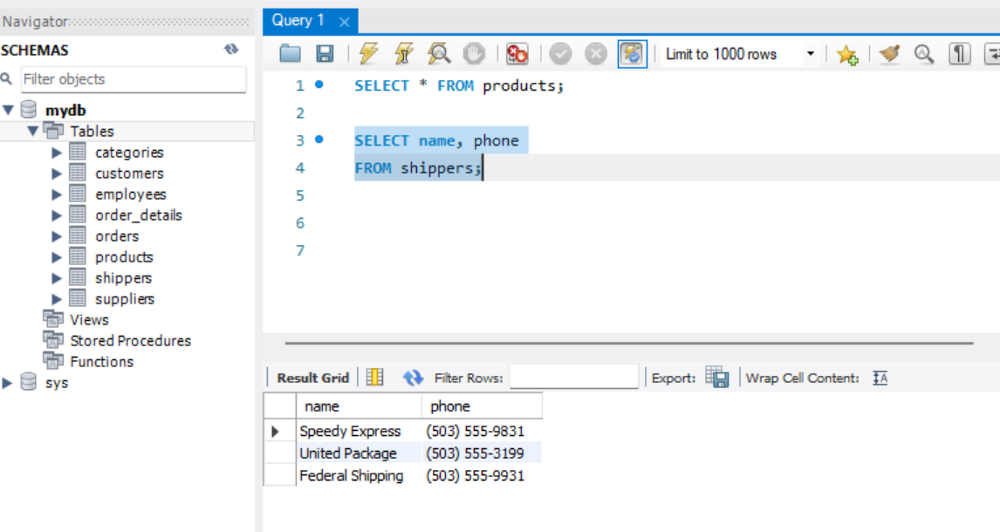
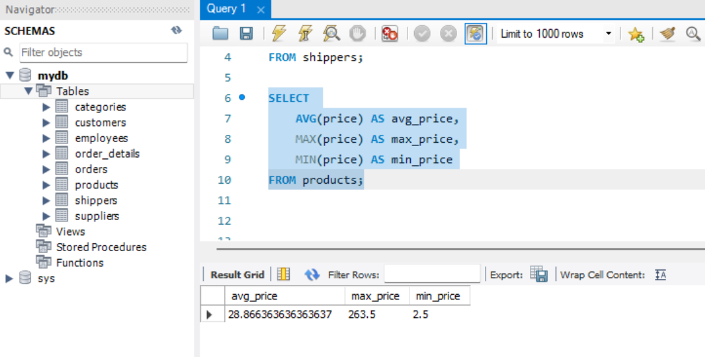
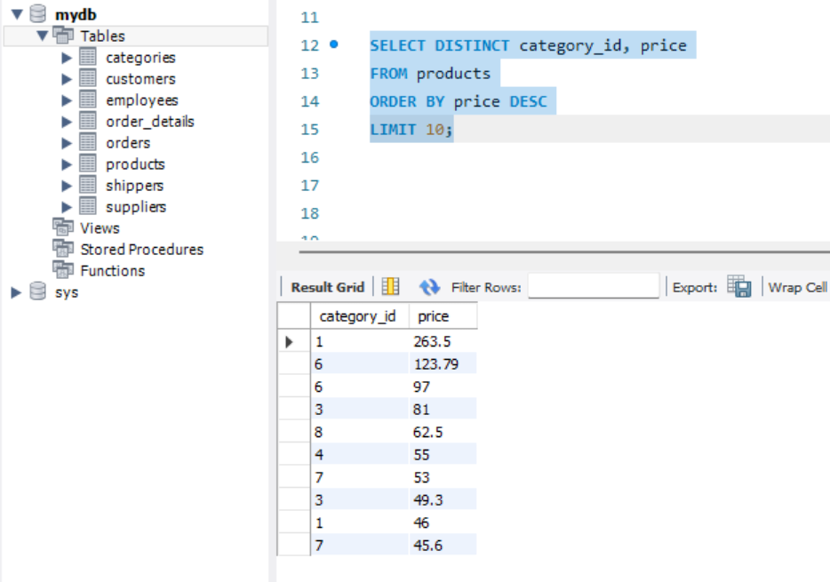
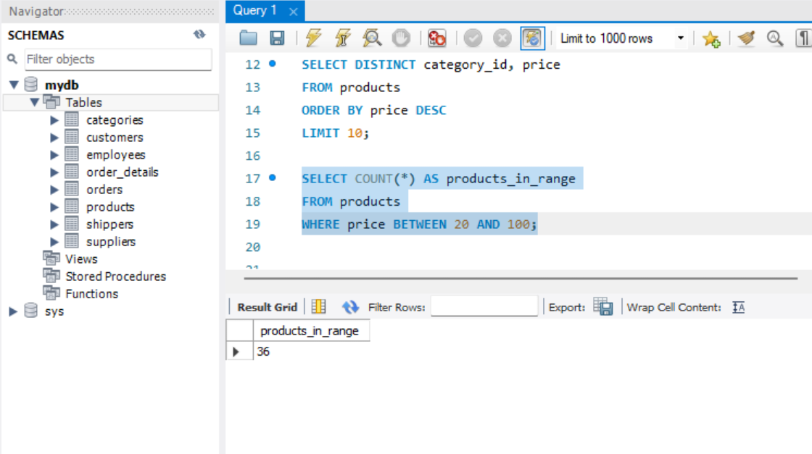
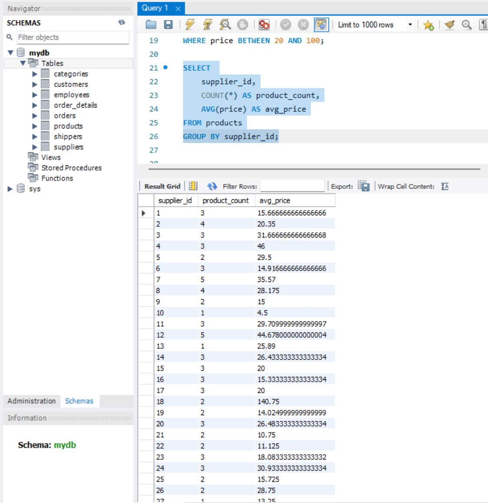

# Домашнє завдання №3
## Тема: Завантаження даних та основи SQL. Команди DQL

У цьому завданні було імпортовано CSV-датасет до бази даних MySQL та виконано п'ять SQL-запитів згідно з умовою.

## Завдання 1
1а. Вибрати всі стовпчики з таблиці products

SQL-запит:
SELECT * FROM products;

Результат:
Повертає всі записи таблиці products (id, name, supplier_id, category_id, unit, price).

1б. Вибрати лише стовпчики name та phone з таблиці shippers

SQL-запит:
SELECT name, phone
FROM shippers;

Результат:
Повертає перелік перевізників та їхні контактні телефони.

## Завдання 2
Знайти середнє, максимальне та мінімальне значення стовпчика price у таблиці products

SQL-запит:

SELECT 
    AVG(price) AS avg_price,
    MAX(price) AS max_price,
    MIN(price) AS min_price
FROM products;

Результат:
Повертає три агреговані значення: середню, максимальну та мінімальну ціну товарів.

## Завдання 3
Обрати унікальні значення category_id та price, відсортувати за спаданням ціни та вивести перші 10 рядків

SQL-запит:

SELECT DISTINCT category_id, price
FROM products
ORDER BY price DESC
LIMIT 10;

Результат:
Виводить 10 унікальних комбінацій із найбільшими значеннями ціни.

## Завдання 4
Знайти кількість продуктів із ціною в межах від 20 до 100

SQL-запит:

SELECT COUNT(*) AS products_in_range
FROM products
WHERE price BETWEEN 20 AND 100;

Результат:
Повертає загальну кількість товарів, ціна яких лежить у заданому діапазоні.

## Завдання 5
Знайти кількість продуктів та середню ціну для кожного постачальника (supplier_id)

SQL-запит:

SELECT 
    supplier_id,
    COUNT(*) AS product_count,
    AVG(price) AS avg_price
FROM products
GROUP BY supplier_id;

Результат:
Повертає кількість товарів та середню ціну для кожного унікального постачальника.

## Висновок

Усі SQL-команди виконано — результати перевірено в MySQL Workbench.
Дані успішно завантажено з CSV-файлів, запити повертають коректні результати.