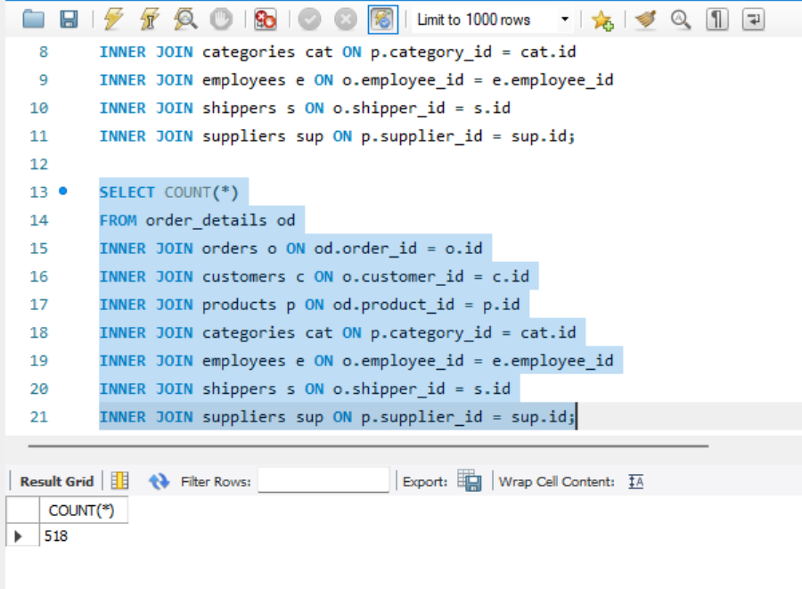
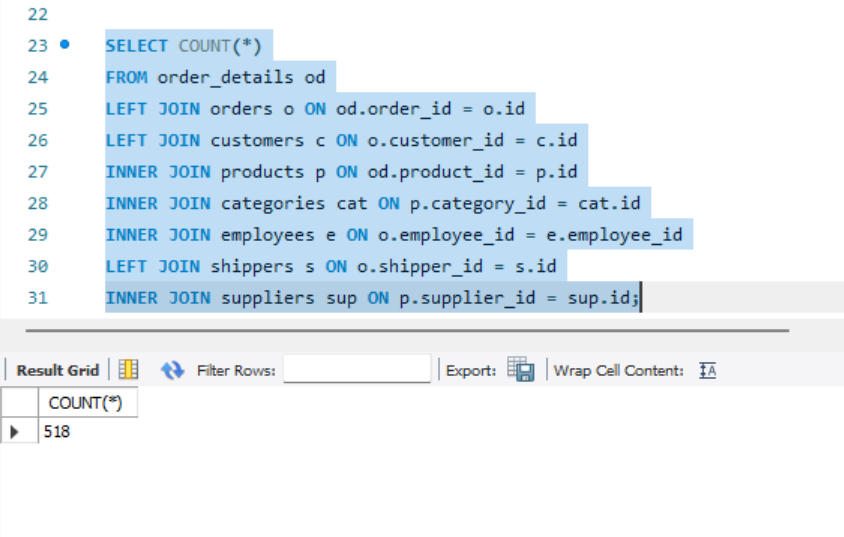
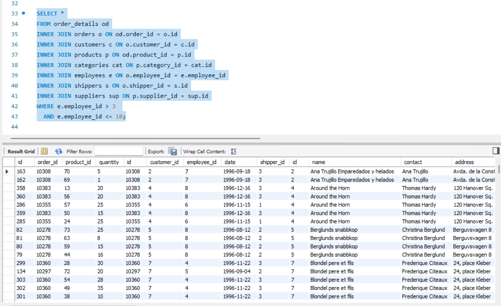

## Part 1 
### 1. Створення схеми та таблиць
CREATE SCHEMA IF NOT EXISTS LibraryManagement;
USE LibraryManagement;

CREATE TABLE authors (
    author_id INT AUTO_INCREMENT PRIMARY KEY,
    author_name VARCHAR(255) NOT NULL
);

CREATE TABLE genres (
    genre_id INT AUTO_INCREMENT PRIMARY KEY,
    genre_name VARCHAR(255) NOT NULL
);

CREATE TABLE books (
    book_id INT AUTO_INCREMENT PRIMARY KEY,
    title VARCHAR(255) NOT NULL,
    publication_year INT,
    author_id INT,
    genre_id INT,
    FOREIGN KEY (author_id) REFERENCES authors(author_id),
    FOREIGN KEY (genre_id) REFERENCES genres(genre_id)
);

CREATE TABLE users (
    user_id INT AUTO_INCREMENT PRIMARY KEY,
    username VARCHAR(255) NOT NULL,
    email VARCHAR(255) NOT NULL
);

CREATE TABLE borrowed_books (
    borrow_id INT AUTO_INCREMENT PRIMARY KEY,
    book_id INT,
    user_id INT,
    borrow_date DATE,
    return_date DATE,
    FOREIGN KEY (book_id) REFERENCES books(book_id),
    FOREIGN KEY (user_id) REFERENCES users(user_id)
);

### 2. Заповнення таблиць
INSERT INTO authors (author_name)
VALUES ('George Orwell'), ('Jane Austen');

INSERT INTO genres (genre_name)
VALUES ('Dystopian'), ('Romance');

INSERT INTO books (title, publication_year, author_id, genre_id)
VALUES
('1984', 1949, 1, 1),
('Pride and Prejudice', 1813, 2, 2);

INSERT INTO users (username, email)
VALUES ('alice','alice@example.com'), ('bob','bob@example.com');

INSERT INTO borrowed_books (book_id, user_id, borrow_date, return_date)
VALUES
(1, 1, '2024-01-10', '2024-01-20'),
(2, 2, '2024-02-05', NULL);

### 3. Перевірка таблиць
SELECT * FROM authors;
SELECT * FROM genres;
SELECT * FROM books;
SELECT * FROM users;
SELECT * FROM borrowed_books;

## Part 2 

Нижче — запити до бази mydb згідно з вимогами завдання.

### 1. Підрахувати кількість рядків (COUNT)
SELECT COUNT(*)
FROM order_details od
INNER JOIN orders o ON od.order_id = o.id
INNER JOIN customers c ON o.customer_id = c.id
INNER JOIN products p ON od.product_id = p.id
INNER JOIN categories cat ON p.category_id = cat.id
INNER JOIN employees e ON o.employee_id = e.employee_id
INNER JOIN shippers s ON o.shipper_id = s.id
INNER JOIN suppliers sup ON p.supplier_id = sup.id;

Screenshot:

INNER JOIN повертає лише ті рядки, де є відповідність у всіх таблицях. Тому кількість результатів є сталою та не містить NULL-значень.

### 2. Змінити декілька INNER JOIN на LEFT JOIN та порівняти
SELECT COUNT(*)
FROM order_details od
LEFT JOIN orders o ON od.order_id = o.id
LEFT JOIN customers c ON o.customer_id = c.id
LEFT JOIN shippers s ON o.shipper_id = s.id
INNER JOIN products p ON od.product_id = p.id;

Screenshot:

LEFT JOIN повертає всі рядки з order_details, навіть якщо у пов'язаних таблицях немає відповідного запису.
Тому:
- кількість рядків збільшується або залишається такою самою,
- у стовпчиках з інших таблиць можуть з’являтися NULL.

### 3. Фільтрація за employee_id > 3 AND <= 10
SELECT *
FROM order_details od
INNER JOIN orders o ON od.order_id = o.id
INNER JOIN customers c ON o.customer_id = c.id
INNER JOIN products p ON od.product_id = p.id
INNER JOIN categories cat ON p.category_id = cat.id
INNER JOIN employees e ON o.employee_id = e.employee_id
INNER JOIN shippers s ON o.shipper_id = s.id
INNER JOIN suppliers sup ON p.supplier_id = sup.id
WHERE e.employee_id > 3
  AND e.employee_id <= 10;

Screenshot:

### 4. Групування, обчислення COUNT та AVG, фільтрація HAVING, сортування, LIMIT OFFSET
SELECT
    cat.name AS category_name,
    COUNT(*) AS row_count,
    AVG(od.quantity) AS avg_quantity
FROM order_details od
INNER JOIN orders o ON od.order_id = o.id
INNER JOIN customers c ON o.customer_id = c.id
INNER JOIN products p ON od.product_id = p.id
INNER JOIN categories cat ON p.category_id = cat.id
INNER JOIN employees e ON o.employee_id = e.employee_id
INNER JOIN shippers s ON o.shipper_id = s.id
INNER JOIN suppliers sup ON p.supplier_id = sup.id
WHERE e.employee_id > 3
  AND e.employee_id <= 10
GROUP BY cat.name
HAVING AVG(od.quantity) > 21
ORDER BY row_count DESC
LIMIT 4 OFFSET 1;

Screenshot:

GROUP BY cat.name — групуємо за категорією товару.
COUNT(*) — рахуємо кількість рядків у кожній групі.
AVG(quantity) — середня кількість замовлених товарів.
HAVING AVG(quantity) > 21 — відфільтровуємо категорії з великим середнім замовленням.
ORDER BY row_count DESC — сортуємо за популярністю.
LIMIT 4 OFFSET 1 — показуємо 4 рядки, пропускаючи перший.