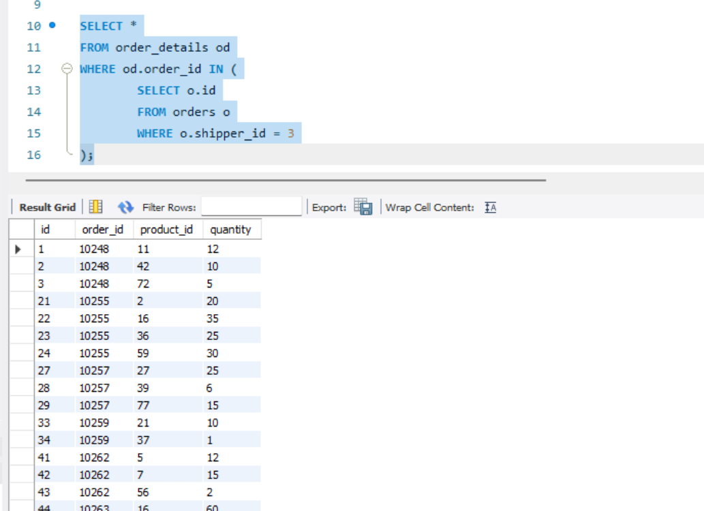
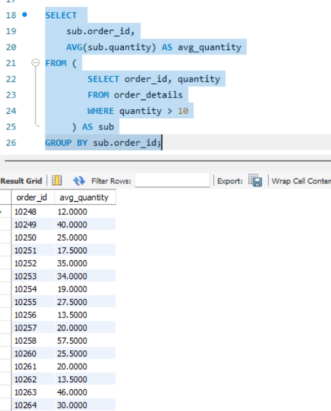
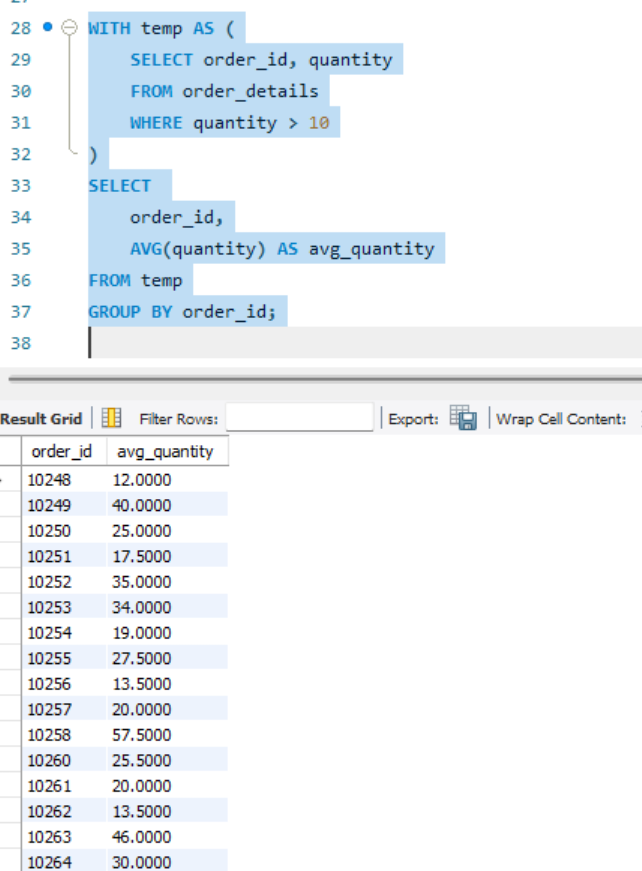
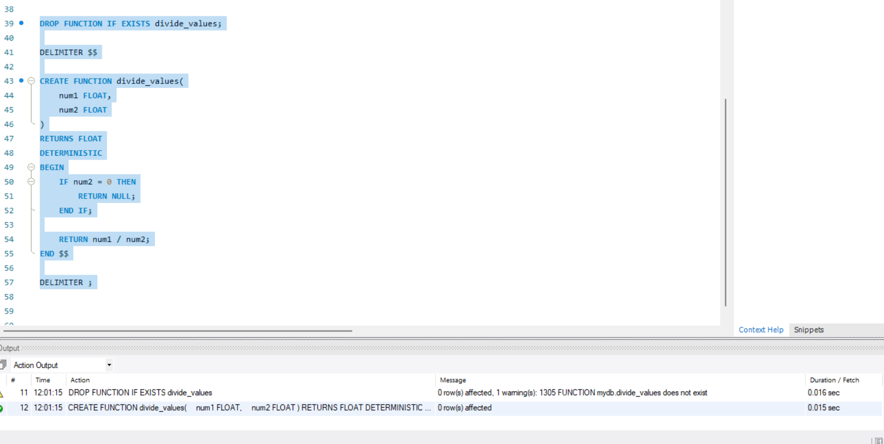
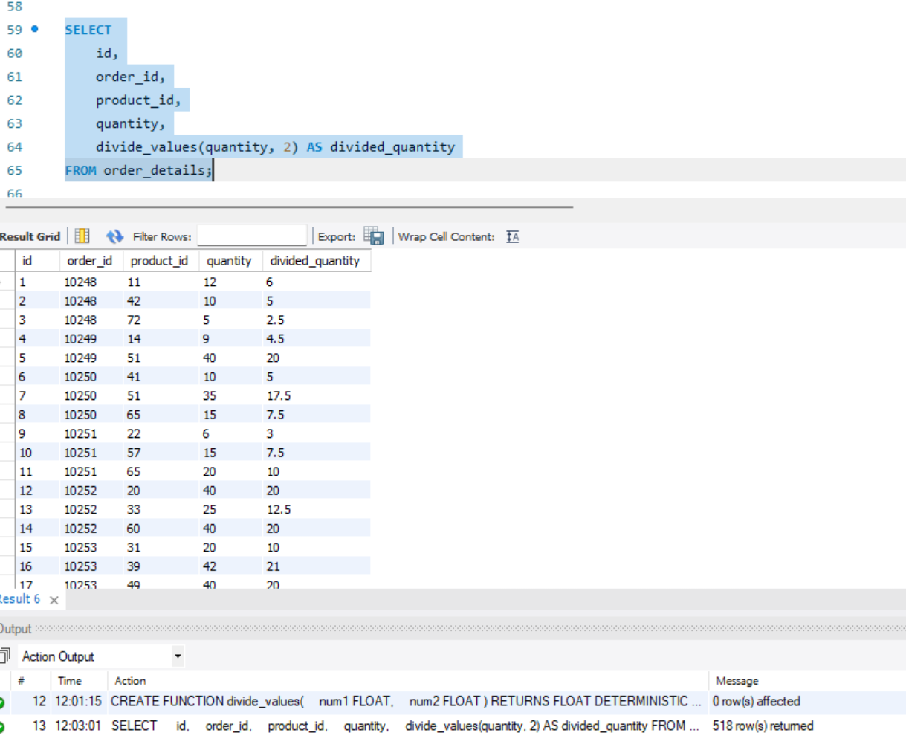

# Домашнє завдання №5

## Крок 1. Вкладений запит у SELECT

Виведіть усі поля таблиці order_details.
Додайте поле customer_id через вкладений запит до таблиці orders.

SELECT
    od.*,
    (SELECT o.customer_id
     FROM orders o
     WHERE o.id = od.order_id) AS customer_id
FROM order_details od;

Скріншот:

## Крок 2. Вкладений запит у WHERE

Відібрати лише ті рядки order_details, де order_id належить замовленням зі shipper_id = 3.

SELECT *
FROM order_details od
WHERE od.order_id IN (
    SELECT o.id
    FROM orders o
    WHERE o.shipper_id = 3
);

Скріншот:

## Крок 3. Вкладений запит у FROM

Спочатку виберіть рядки з quantity > 10.
Далі згрупуйте їх за order_id і знайдіть середнє значення quantity.

SELECT
    sub.order_id,
    AVG(sub.quantity) AS avg_quantity
FROM (
    SELECT order_id, quantity
    FROM order_details
    WHERE quantity > 10
) AS sub
GROUP BY sub.order_id;

Скріншот:

## Крок 4. Використання WITH (CTE)

Створіть тимчасову таблицю temp через CTE.
Повторіть обчислення середнього значення quantity.

WITH temp AS (
    SELECT order_id, quantity
    FROM order_details
    WHERE quantity > 10
)
SELECT
    order_id,
    AVG(quantity) AS avg_quantity
FROM temp
GROUP BY order_id;

Скріншот:

## Крок 5. Створення та використання функції

Створіть функцію divide_values(num1, num2) типу FLOAT.
Додайте захист від ділення на нуль.
Використайте функцію для ділення quantity на 2.

DROP FUNCTION IF EXISTS divide_values;

DELIMITER $$

CREATE FUNCTION divide_values(
    num1 FLOAT,
    num2 FLOAT
)
RETURNS FLOAT
DETERMINISTIC
BEGIN
    IF num2 = 0 THEN
        RETURN NULL;
    END IF;

    RETURN num1 / num2;
END $$

DELIMITER ;

Використання функції:
SELECT
    id,
    order_id,
    product_id,
    quantity,
    divide_values(quantity, 2) AS divided_quantity
FROM order_details;

Скріншот (створення):

Скріншот (використання):
