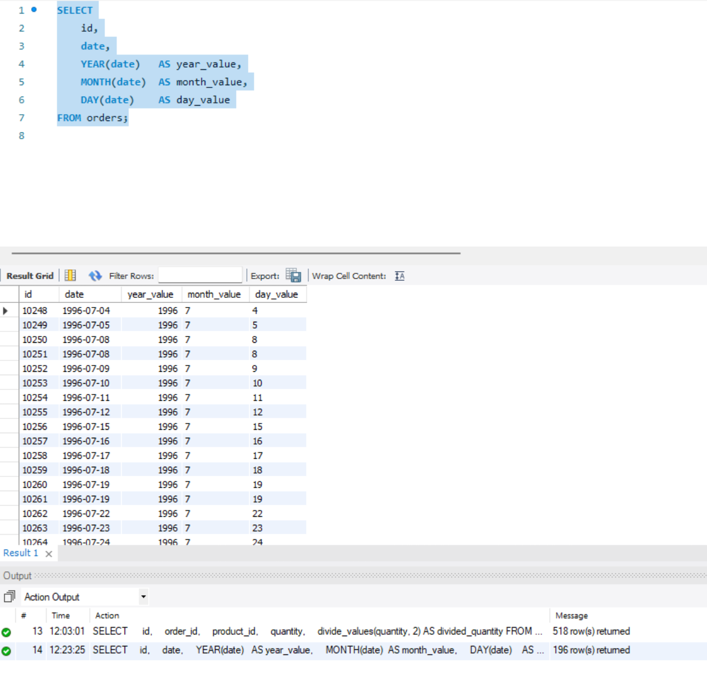
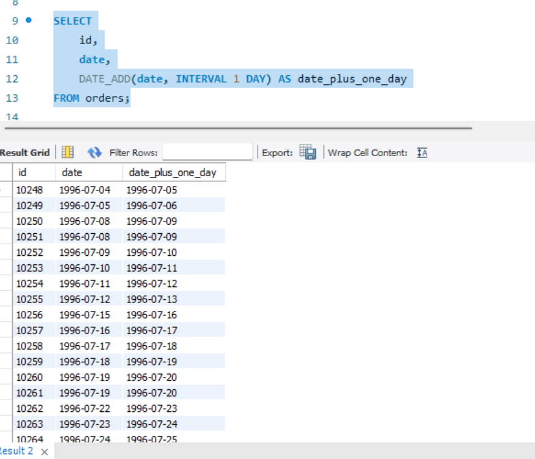
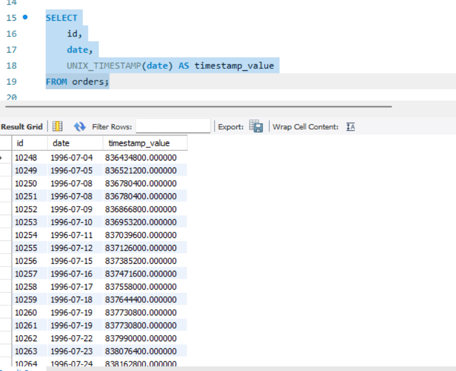
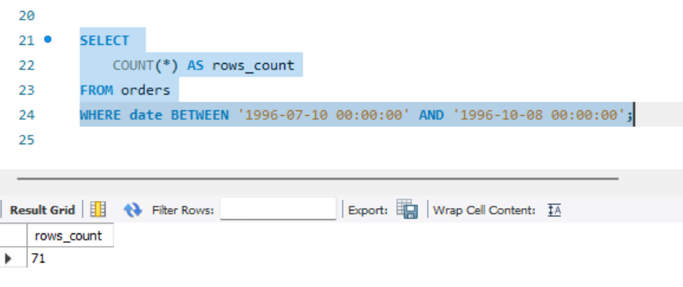
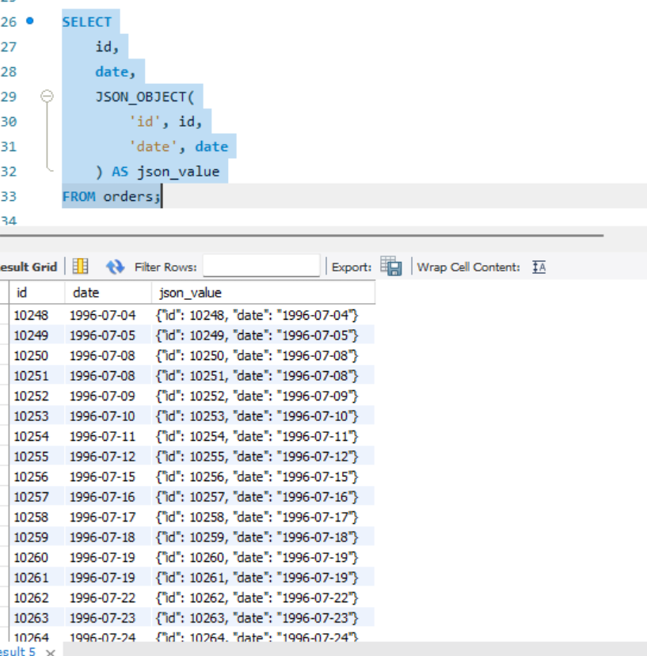

# Домашнє завдання №7

## Крок 1. Витягнути частини дати: рік, місяць, день

Напишіть SQL-запит, який для таблиці orders з атрибута date витягує рік, місяць і число.
Виведіть атрибути: id, date, year_value, month_value, day_value.

SELECT
    id,
    date,
    YEAR(date)  AS year_value,
    MONTH(date) AS month_value,
    DAY(date)   AS day_value
FROM orders;

Скріншот:

## Крок 2. Додати один день до дати

Напишіть SQL-запит, який до атрибута date додає один день і виводить результат.

SELECT
    id,
    date,
    DATE_ADD(date, INTERVAL 1 DAY) AS date_plus_one_day
FROM orders;

Скріншот:

## Крок 3. Отримати UNIX timestamp

Напишіть SQL-запит, який для атрибута date повертає кількість секунд з початку епохи UNIX.

SELECT
    id,
    date,
    UNIX_TIMESTAMP(date) AS timestamp_value
FROM orders;

Скріншот:

## Крок 4. Порахувати кількість рядків у діапазоні дат

Порахуйте, скільки рядків у таблиці orders мають дату в межах
1996-07-10 00:00:00 — 1996-10-08 00:00:00.

SELECT
    COUNT(*) AS rows_count
FROM orders
WHERE date BETWEEN '1996-07-10 00:00:00'
              AND '1996-10-08 00:00:00';

Скріншот:

## Крок 5. Вивести JSON-об’єкт із id та date

Створіть JSON-об’єкт виду:
{"id": <значення id>, "date": "<значення date>"}

SELECT
    id,
    date,
    JSON_OBJECT(
        'id',   id,
        'date', date
    ) AS json_value
FROM orders;

Скріншот:
